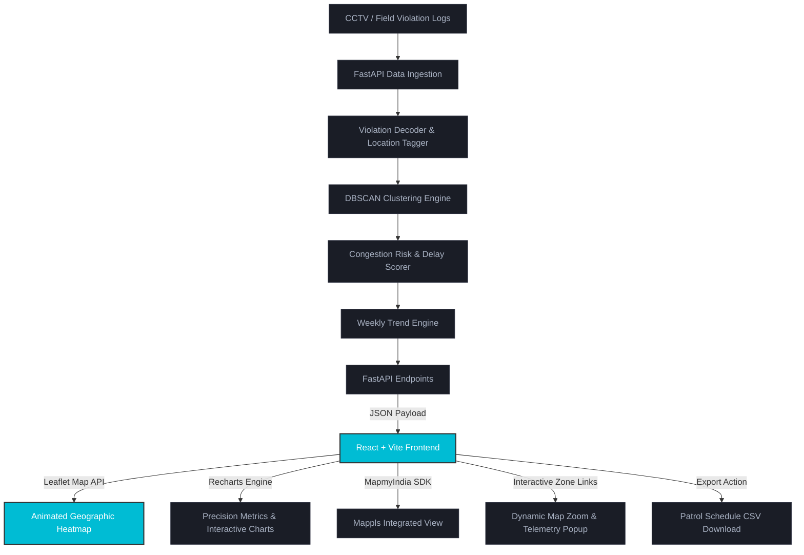

# 🚦 BTP Enforcement Intelligence Dashboard
**Gridlock 2.0 Hackathon Final Submission (Track 1 — Bengaluru Traffic Police ASTraM Unit)**

An AI-driven parking intelligence and traffic congestion optimization dashboard built for the Bengaluru Traffic Police. The platform ingests CCTV/field violation logs, aggregates offenses spatially using **DBSCAN clustering**, quantifies their impact on traffic flow using an **Estimated Vehicle-Delay model**, and outputs an automated daily patrol schedule for ASTraM officers.

---

## 📌 The Challenge: Parking-Induced Congestion
On-street illegal parking and spillover parking near commercial areas, metro stations, and schools choke Bangalore's carriageways and critical junctions. 
* **Reactive Policing:** Enforcement is historically patrol-based and reactive.
* **No Impact Mapping:** There has been no correlation mapping between parking violations and actual traffic flow delays.
* **Under-Enforced Zones:** Hard to identify and prioritize "gap zones" where violation density is high but citation rates are low.

---

## 🎯 Core Capabilities & AI Models

1. **DBSCAN Spatial Clustering ($\epsilon=150$m, Min=5)**
   - Group raw GPS coordinates of citations to automatically discover illegal parking hotspots.
2. **Estimated Vehicle-Delay Model**
   - Estimates cumulative vehicle-hours lost per hotspot by calculating carriageway blockage % (based on vehicle type/size mix) and duration.
3. **Enforcement Gap Audits**
   - Automatically flags "Gap Zones" where the ticket approval rate falls below 60%, indicating a critical need for targeted officer patrols.
4. **Apple Fitness-Style Activity Rings**
   - Visualizes precinct compliance, approval rates, and patrol completion rates on a sleek, high-fidelity dial interface.
5. **Interactive Map Navigation & Zoom**
   - Fully interactive tables where clicking any Zone ID (e.g. `#2`) triggers a smooth, animated camera fly-to directly on the Leaflet map and auto-opens its detailed telemetry popup.

---

## 🏗 System Architecture



---

## 🛠 Tech Stack

* **Backend**: Python, FastAPI, Pandas, Scikit-Learn (DBSCAN), Uvicorn
* **Frontend**: React (Vite), React-Leaflet, Recharts, Lucide Icons, Vanilla CSS (Glassmorphism & Neon accents)
* **API Integration**: MapmyIndia (Mappls Web SDK)
* **DevOps**: Docker (Multi-stage build), Git LFS (Large File Storage)

---

## 🚀 Running the Project Locally

### 1. Prerequisites
- Python 3.10+
- Node.js 18+ & npm

### 2. Setup Files
- Place the violations dataset at `data/violations.csv`
- Create a `.env` file in the root directory:
  ```env
  MAPMYINDIA_API_KEY=your_actual_mappls_api_token
  ```

### 3. Option A: Split-Process Development (Recommended)
Launch the backend and frontend separately to enjoy hot-reloading:

**Terminal 1 (FastAPI Backend)**:
```bash
# Set up virtual environment and install packages
python -m venv venv
.\venv\Scripts\activate
pip install -r requirements.txt

# Run backend API
uvicorn api:app --host 127.0.0.1 --port 8000
```

**Terminal 2 (React Frontend)**:
```bash
cd frontend
npm install
npm run dev
```
Open **[http://localhost:5173/](http://localhost:5173/)** to access the dashboard.

### 4. Option B: Unified FastAPI Production Build
Serve the compiled React static bundle directly from the FastAPI root path:
```bash
# 1. Compile frontend assets
cd frontend
npm install
npm run build
cd ..

# 2. Run backend (FastAPI mounts and serves frontend/dist automatically)
uvicorn api:app --host 127.0.0.1 --port 8000
```
Open **[http://127.0.0.1:8000/](http://127.0.0.1:8000/)** to access the single-port production server.

---

## 🐳 Docker Deployment & Hugging Face Spaces

This project is fully Dockerized for containerized hosting on cloud platforms like Hugging Face Spaces.

### 1. Build & Run Docker Image Locally
```bash
# Build the Docker image (Multi-stage compile)
docker build -t btp-dashboard .

# Run the container (MapmyIndia API key passed as env var)
docker run -p 7860:7860 -e MAPMYINDIA_API_KEY="your_api_key" btp-dashboard
```
Open **`http://localhost:7860`** to view the app running in Docker.

### 2. Deploy to Hugging Face Spaces (24/7 Free Hosting)
1. Create a **Docker Space** with a **Blank** template on Hugging Face.
2. Initialize and configure Git LFS locally to handle the 100MB+ dataset:
   ```bash
   git lfs install
   git lfs track "*.csv"
   ```
3. Push your files directly to your Hugging Face Space git remote.
4. Go to **Settings > Variables and secrets** on Hugging Face and add your `MAPMYINDIA_API_KEY` as a Secret.
5. Hugging Face will compile the image and deploy the live dashboard automatically!

---

## 📁 Repository Structure
```
├── data/
│   └── violations.csv           # ASTraM anonymized citation logs (LFS tracked)
├── components/
│   └── mapmyindia_map.html      # Injected template for Mappls API rendering
├── modules/
│   ├── data_loader.py           # Preprocesses and cleans citation records
│   ├── clustering.py            # Executes DBSCAN hotspot grouping
│   ├── scoring.py               # Implements congestion score & vehicle-delay model
│   ├── trend_engine.py          # Tracks week-over-week growth metrics
│   └── patrol_scheduler.py      # Assigns daily officer shift schedules
├── frontend/
│   ├── src/
│   │   ├── App.jsx              # Main UI, state flow, and page router
│   │   └── index.css            # Dark mode, glassmorphism CSS architecture
│   ├── package.json             # React/Vite dependencies
│   └── vite.config.js           # Development proxy mapping
├── api.py                       # FastAPI core routes & static serving
├── Dockerfile                   # Optimized multi-stage Docker build config
└── requirements.txt             # Python backend dependencies
```
