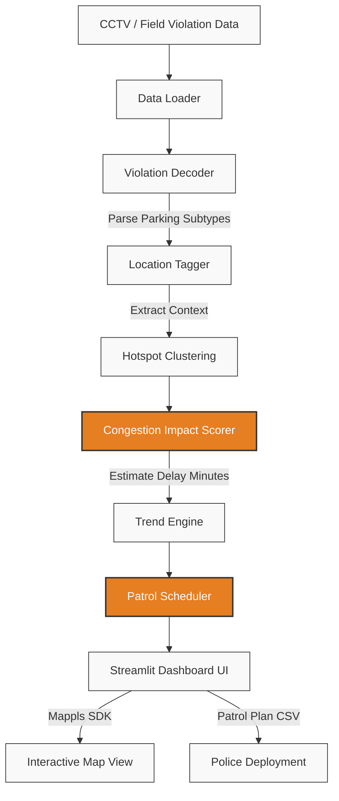

# BTP Enforcement Intelligence
**Gridlock 2.0 Hackathon Final Submission (Track 1)**

An AI-driven parking intelligence dashboard for the Bengaluru Traffic Police (ASTraM unit). It processes CCTV/violation data to detect illegal parking hotspots, quantifies their impact on traffic congestion, and generates actionable daily patrol schedules to optimize enforcement.

## 🎯 Core Capabilities
- **Enforcement Gap Detection:** Flags zones where officers are under-patrolling compared to AI-detected violations.
- **Traffic Delay Estimation Model:** Calculates vehicle-hours of delay based on vehicle weight and carriageway blockage %.
- **Daily Patrol Scheduler:** Outputs a daily shift plan indicating priority, personnel required (1–6), and peak times per hotspot.
- **Mappls Integration:** Visualizes the city's worst blockages via MapmyIndia Web SDK with impact-color-coded pins.

## 🏗 System Architecture



## 🛠 Setup & Run

1. Place the historical data at `data/violations.csv`
2. Get a MapmyIndia API key from https://www.mapmyindia.com/api
3. Install Python dependencies:
   ```bash
   pip install -r requirements.txt
   ```
4. Create your environment file:
   ```bash
   cp .env.example .env
   ```
   Open `.env` and replace `your_key_here` with your actual MapmyIndia API key.
5. Run the intelligence dashboard:
   ```bash
   streamlit run app.py
   ```
